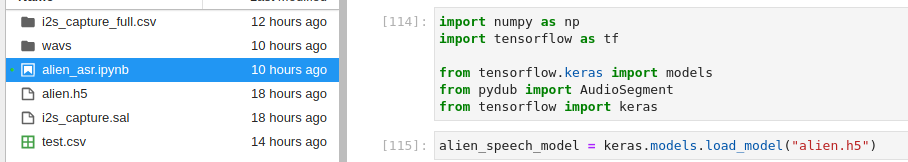
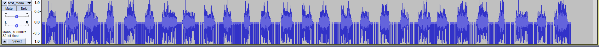

# Alien Speak
## Input discovery
We are provided 3 files
- alien_asr.ipynb
- alien.h5
- i2s_capture.sal

First thing to do: discover what they are, and what we can get from them.

### alien_asr.ipynb
Using the `file` command, we determine it is a Jupyter notebook left by the scientists.  
We know Jupyter notebooks are well used by data scientist, and it can be used to share and replay code.

Opening it in Jupyter we can see two “TODO” showing the work the scientists did not had the time to do. (Full file in "resources file at the end.)

```python
# this is a refactor of the classification script to try to keep things tidied
# TODO: load the alien_speech_model
```

```python
# currently only classifying phonemes separately
# TODO: make it work with a whole sentence

# char_class = classify_phoneme('alien_phoneme.wav')
```

Expecting good variable naming, we expect that calling classify_phoneme with a proper WAV file will open it, apply a ML model that can recognize Alien phonemes and identify the corresponding character in our language.  
To make it work, we will need the ML model, we also need phonemes. In addition a comment on top of the method `get_spectrogram` tells us it can handle 16000 samples = 1 second, so we can expect the WAV file to be at 16 kHz, and length less than 1 second.

### alien.h5
h5 is like having a folder/file structure inside a single file.
We can use Panoply (https://www.giss.nasa.gov/tools/panoply/download/) to open the file.

Seeing it talks about "model" and "weights", this very looks like a ML model.
In the global attributes we can see references to tensorflow and keras.


### i2s_capture.sal
Checking the type, it seems to be an archive.
```bash
file i2s_capture.sal       
# i2s_capture.sal: Zip archive data, at least v2.0 to extract
```

After opening it we are welcome with 3 files:
- digital-1.bin
- digital-2.bin
- digital-3.bin
- meta.json

`file` doesn't provide much info about digital-1.bin
Using `hexdump` provides additional information
```bash
hexdump -C digital-1.bin| head         
# 00000000  3c 53 41 4c 45 41 45 3e  01 00 00 00 64 00 00 00  |<SALEAE>....d...|
# 00000010  01 00 00 00 00 84 d7 87  41 a1 75 34 a6 78 01 00  |........A.u4.x..|
# 00000020  00 b4 c8 76 be 9f 1a eb  3f 00 00 40 03 00 00 00  |...v....?..@....|
# 00000030  00 00 00 00 00 00 00 00  00 00 00 00 80 19 00 00  |................|
# 00000040  00 00 00 00 80 19 00 00  00 00 00 80 f0 fa 02 00  |................|
# 00000050  00 00 00 01 00 00 00 00  00 00 00 04 00 00 00 00  |................|
# 00000060  00 00 00 40 e5 ff 7f 01  00 00 00 00 00 00 00 00  |...@............|
# 00000070  00 00 00 00 00 00 00 00  00 00 00 00 00 00 00 00  |................|
# 00000080  00 00 00 00 80 19 00 00  00 00 00 00 00 33 00 00  |.............3..|
# 00000090  00 00 00 00 80 19 00 00  00 00 00 80 f0 fa 02 00  |................|
```

Looking up SALEAE on a search engine, we understand the i2s_capture.sal file is in a specific format and not a zip.
We can open it using [Logic 2](https://www.saleae.com/downloads/) from saleae.


We have 3 channels, BCLK, LRCLK, DOUT.
Looking up those terms, we stumble on LRCLK being part of I²S (looks like the name of our file).

Tools exists to create a WAV file from an I2S/PCM capture.  
We can use [PCM2Wav](https://github.com/roel0/PCM2Wav-py). With a [tip](https://twitter.com/saleae/status/625854335046565889?lang=en) from Saleae on Twitter that we should analyze the I2S capture with the option signed decimal, and then export it.
And we remember from the Jupyter notebook that we are looking at 16 kHz WAV files.

Based on that, we can extract our beautiful WAV file of 26 seconds with what looks like some Alien phonemes and a lot of noise.

## Making sense of the input
### Loading the model
The import tensorflow.keras can open h5 files natively. Hence, loading the model is straightforward.



### Handle phonemes
#### Stereo to Mono
Trying to read the whole WAV file will fail because it is more than 1s.  
If we do try to load it still, we get an error that is not linked to that:
> InvalidArgumentError: Can not squeeze dim[1], expected a dimension of 1, got 2

Our WAV file is in _Stereo_, but we need it to be in _Mono_.  
Audacity will to the trick.

Stereo:


Mono:


Visually we can identify 27 phonemes in a 26s file. It looks promising considering the 1s limitation to identify a phoneme.

#### First try
We do not have any information about the dataset that help build the ML model.  
Was it provided phonemes with noises, without noises, both?  
Was it provided only the phonemes, or also some silence before/after?

In the best case scenario, the AI was trained with a very diverse dataset. We can cut the file in 27 parts, each containing a single phoneme, and apply the Jupyter notebook on it.

Let's take the first phoneme 
```python
from pydub import AudioSegment
t1 = 0
t2 = 700
newAudio = AudioSegment.from_wav("test.wav")
newAudio = newAudio[t1:t2]
newAudio.export('test-01.wav', format="wav")
```

Jupyter notebook says it is a `C`. Great, that's how our flag begins!  
Identifying the 4 next characters, we do not end up with `CHTB{`

#### Second try
Remember the noise? Let's remove it with Noise Reduction in Audacity.


Looks better. We can identify the beginning/ending of each phonemes now.  
The result also looks better, but not enough `CHTBMCL1TNC_<T_H4THH_MUC1C_`.

#### Third try
Along with the noise, we might have removed a bit of the Alien speech. But it seems like the AI was trained without noise though.

The noise is continuous, and might only affect certain frequencies.  
We can delete those frequencies in the spectrogram.  
Looking at the spectrogram, we can see weird signs, exactly where we have the phonemes.

New result: `CHTB{4L13NN_<T_H4THH_MUT1C_`
Slightly better than the second try, at least we have the beginning of the flag.

Before:


After:


#### Fourth try
Let's remove some additional noise (as in Second Try), and now that there is very few noise left, let's split the file with not just the phoneme but also some silence before and after.

New result: `CHTB{4L13N5_<3_34N7H_MU51C}`  
Bingo, the AI was trained from phonemes without the noise!  
Well not exactly bingo, "34N7H" doesn't look like a word.


#### Final move


Matching the weird signs in the spectrogram with our findings, in the word "34N7H", 3, 4 and H seems correct. 7 has never been seen so why not. However N is definitely not good.  
What are the words of 5 letters in the form EA..H (or maybe EA.TH)? => EARTH (such lists can be easily found on a search engine)

With that, we have our flag.
`CHTB{4L13N5_<3_34R7H_MU51C}`


## Resources
### WAV cutter
```python
from pydub import AudioSegment
newAudio = AudioSegment.from_wav("test_mono_spectral_delete_denoised2.wav")

newAudio1 = newAudio[0:700]
newAudio1.export('test-01.wav', format="wav")

newAudio2 = newAudio[1050:1600]
newAudio2.export('test-02.wav', format="wav")

newAudio3 = newAudio[1730:2530]
newAudio3.export('test-03.wav', format="wav")

newAudio4 = newAudio[2957:3540]
newAudio4.export('test-04.wav', format="wav")

newAudio5 = newAudio[3790:4673]
newAudio5.export('test-05.wav', format="wav")

newAudio6 = newAudio[4690:5520]
newAudio6.export('test-06.wav', format="wav")

newAudio7 = newAudio[5552:6551]
newAudio7.export('test-07.wav', format="wav")

newAudio8 = newAudio[6549:7512]
newAudio8.export('test-08.wav', format="wav")

newAudio9 = newAudio[7484:8423]
newAudio9.export('test-09.wav', format="wav")

newAudio10 = newAudio[8370:9250]
newAudio10.export('test-10.wav', format="wav")

newAudio11 = newAudio[9288:10165]
newAudio11.export('test-11.wav', format="wav")

newAudio12 = newAudio[10158:11110]
newAudio12.export('test-12.wav', format="wav")

newAudio13 = newAudio[11131:12130]
newAudio13.export('test-13.wav', format="wav")

newAudio14 = newAudio[12122:13020]
newAudio14.export('test-14.wav', format="wav")

newAudio15 = newAudio[13019:13798] # DOUBT
newAudio15.export('test-15.wav', format="wav")

newAudio16 = newAudio[13929:14881]
newAudio16.export('test-16.wav', format="wav")

newAudio17 = newAudio[14912:15732]
newAudio17.export('test-17.wav', format="wav")

newAudio18 = newAudio[15952:16574]
newAudio18.export('test-18.wav', format="wav")

newAudio19 = newAudio[16944:17518]
newAudio19.export('test-19.wav', format="wav")

newAudio20 = newAudio[17653:18600] # DOUBT?
newAudio20.export('test-20.wav', format="wav")

newAudio21 = newAudio[18588:19419] # DOUBT
newAudio21.export('test-21.wav', format="wav")

newAudio22 = newAudio[19505:20465]
newAudio22.export('test-22.wav', format="wav")

newAudio23 = newAudio[20465:21370]
newAudio23.export('test-23.wav', format="wav")

newAudio24 = newAudio[21461:22150]
newAudio24.export('test-24.wav', format="wav")

newAudio25 = newAudio[22270:23229]
newAudio25.export('test-25.wav', format="wav")

newAudio26 = newAudio[23297:24131]
newAudio26.export('test-26.wav', format="wav")

newAudio27 = newAudio[24150:25119]
newAudio27.export('test-27.wav', format="wav")
```

### Jupyter notebook
Initially:
```python
# this is a refactor of the classification script to try to keep things tidied
# TODO: load the alien_speech_model

import numpy as np
import tensorflow as tf

from tensorflow.keras import models
from pydub import AudioSegment

char_classes = ['0', '1', '2', '3', '4', '5', '6', '7', '8', '9', '<', '_', 'B', 'C', 'H', 'L', 'M', 'N', 'R', 'T', 'U', '{', '}', 'A', 'Z', 'V', ':', 'D', '!', '.', 'J', 'X', 'G', '>', 'P', 'O', 'W', 'E', '&', 'Q', 'S', 'F', 'K', 'I', 'D', 'Y']

# get only the waveform from the wav file
def decode_audio(audio_binary):
  #audio, _ = tf.audio.decode_wav(audio_binary, desired_channels=1)
  audio, _ = tf.audio.decode_wav(audio_binary)
  return tf.squeeze(audio, axis=-1)

# read the wav file and return the waveform
def get_waveform(file_path):
  audio_binary = tf.io.read_file(file_path)
  waveform = decode_audio(audio_binary)
  return waveform

# builds a spectrogram out of the waveform (using a short-time fourier transform)
# can handle at most 16000 samples = 1 second
def get_spectrogram(waveform):
  zero_padding = tf.zeros([16000] - tf.shape(waveform), dtype=tf.float32)

  waveform = tf.cast(waveform, tf.float32)
  equal_length = tf.concat([waveform, zero_padding], 0)
  spectrogram = tf.signal.stft(
      equal_length, frame_length=255, frame_step=128)
      
  spectrogram = tf.abs(spectrogram)

  return spectrogram

# adds a dimension to the spectrogram data structure
def get_spectrogram_audio(audio):
  spectrogram = get_spectrogram(audio)
  spectrogram = tf.expand_dims(spectrogram, -1)
  return spectrogram

# extracts features from the audio file
def preprocess_dataset(files):
  files_ds = tf.data.Dataset.from_tensor_slices(files)
  output_ds = files_ds.map(get_waveform, num_parallel_calls=tf.data.AUTOTUNE)
  output_ds = output_ds.map(
      get_spectrogram_audio,  num_parallel_calls=tf.data.AUTOTUNE)
  return output_ds

def classify_phoneme(filename):
    sample_ds = preprocess_dataset([str(filename)])
    for spectrogram in sample_ds.batch(1):
        # attempts to match the phoneme to a character class
        # alien_speech_model: the trained machine learning model that will try to classify the phoneme
        prediction = np.array(alien_speech_model(spectrogram)[0])
        class_index = np.argmax(prediction)
        return char_classes[np.argmax(prediction)]

# currently only classifying phonemes separately
# TODO: make it work with a whole sentence

char_class = classify_phoneme('alien_phoneme.wav')
print(char_class)
```

In the end:
```python
import numpy as np
import tensorflow as tf

from tensorflow.keras import models
from pydub import AudioSegment
from tensorflow import keras # LINE ADDED

alien_speech_model = keras.models.load_model("alien.h5") # LINE ADDED

char_classes = ['0', '1', '2', '3', '4', '5', '6', '7', '8', '9', '<', '_', 'B', 'C', 'H', 'L', 'M', 'N', 'R', 'T', 'U', '{', '}', 'A', 'Z', 'V', ':', 'D', '!', '.', 'J', 'X', 'G', '>', 'P', 'O', 'W', 'E', '&', 'Q', 'S', 'F', 'K', 'I', 'D', 'Y']

# get only the waveform from the wav file
def decode_audio(audio_binary):
  #audio, _ = tf.audio.decode_wav(audio_binary, desired_channels=1)
  audio, _ = tf.audio.decode_wav(audio_binary)
  return tf.squeeze(audio, axis=-1)

# read the wav file and return the waveform
def get_waveform(file_path):
  audio_binary = tf.io.read_file(file_path)
  waveform = decode_audio(audio_binary)
  return waveform

# builds a spectrogram out of the waveform (using a short-time fourier transform)
# can handle at most 16000 samples = 1 second
def get_spectrogram(waveform):
  zero_padding = tf.zeros([16000] - tf.shape(waveform), dtype=tf.float32)

  waveform = tf.cast(waveform, tf.float32)
  equal_length = tf.concat([waveform, zero_padding], 0)
  spectrogram = tf.signal.stft(
      equal_length, frame_length=255, frame_step=128)
      
  spectrogram = tf.abs(spectrogram)

  return spectrogram

# adds a dimension to the spectrogram data structure
def get_spectrogram_audio(audio):
  spectrogram = get_spectrogram(audio)
  spectrogram = tf.expand_dims(spectrogram, -1)
  return spectrogram

# extracts features from the audio file
def preprocess_dataset(files):
  files_ds = tf.data.Dataset.from_tensor_slices(files)
  output_ds = files_ds.map(get_waveform, num_parallel_calls=tf.data.AUTOTUNE)
  output_ds = output_ds.map(
      get_spectrogram_audio,  num_parallel_calls=tf.data.AUTOTUNE)
  return output_ds

def classify_phoneme(filename):
    sample_ds = preprocess_dataset([str(filename)])
    for spectrogram in sample_ds.batch(1):
        # attempts to match the phoneme to a character class
        # alien_speech_model: the trained machine learning model that will try to classify the phoneme
        prediction = np.array(alien_speech_model(spectrogram)[0])
        class_index = np.argmax(prediction)
        return char_classes[np.argmax(prediction)]

char_class1 = classify_phoneme('wavs/test-01.wav')
char_class2 = classify_phoneme('wavs/test-02.wav')
char_class3 = classify_phoneme('wavs/test-03.wav')
char_class4 = classify_phoneme('wavs/test-04.wav')
char_class5 = classify_phoneme('wavs/test-05.wav')
char_class6 = classify_phoneme('wavs/test-06.wav')
char_class7 = classify_phoneme('wavs/test-07.wav')
char_class8 = classify_phoneme('wavs/test-08.wav')
char_class9 = classify_phoneme('wavs/test-09.wav')
char_class10 = classify_phoneme('wavs/test-10.wav')
char_class11 = classify_phoneme('wavs/test-11.wav')
char_class12 = classify_phoneme('wavs/test-12.wav')
char_class13 = classify_phoneme('wavs/test-13.wav')
char_class14 = classify_phoneme('wavs/test-14.wav')
char_class15 = classify_phoneme('wavs/test-15.wav')
char_class16 = classify_phoneme('wavs/test-16.wav')
char_class17 = classify_phoneme('wavs/test-17.wav')
char_class18 = classify_phoneme('wavs/test-18.wav')
char_class19 = classify_phoneme('wavs/test-19.wav')
char_class20 = classify_phoneme('wavs/test-20.wav')
char_class21 = classify_phoneme('wavs/test-21.wav')
char_class22 = classify_phoneme('wavs/test-22.wav')
char_class23 = classify_phoneme('wavs/test-23.wav')
char_class24 = classify_phoneme('wavs/test-24.wav')
char_class25 = classify_phoneme('wavs/test-25.wav')
char_class26 = classify_phoneme('wavs/test-26.wav')
char_class27 = classify_phoneme('wavs/test-27.wav')

print(char_class1 + char_class2 + char_class3 + char_class4 + char_class5 + char_class6 + char_class7 + char_class8 + char_class9 + char_class10 + char_class11 + char_class12 + char_class13 + char_class14 + char_class15 + char_class16 + char_class17 + char_class18 + char_class19 + char_class20 + char_class21 + char_class22 + char_class23 + char_class24 + char_class25 + char_class26 + char_class27)
```