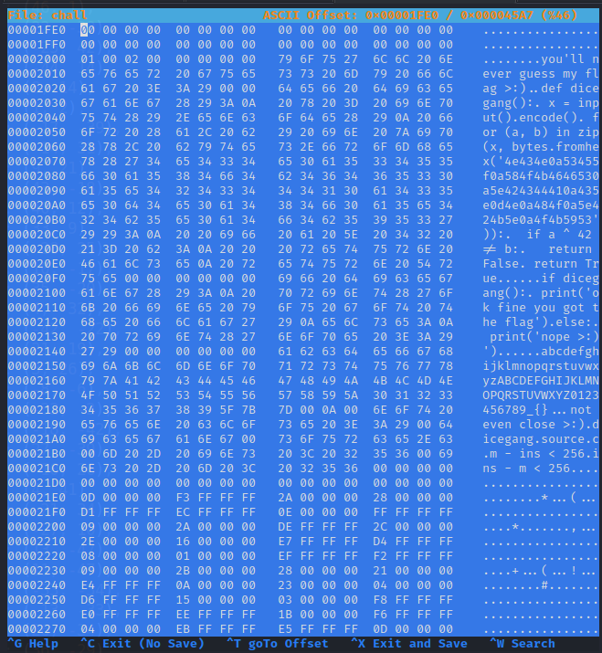

All of you fools debating over x86 vs ARM don't know that CPython bytecode is the future.

Tested under the python:3.10-slim-bullseye Docker image.

# Intro
In this challenge we got a binary. Executing it we can enter a String (aze below) and then the program exit.
```console
$ ./chall        
you'll never guess my flag >:)
aze
not even close >:)
```


This write up has been written as a step by step guide, with explanation of each steps. If you struggled solving it, I hope you will be able to pinpoint the little thing that was blocking you.

# Discovery
## Disassembly
In IDA, after decompiling the binary (a full copy of it is available at the end of this WU, under Attachments) we notice a program with the following structure:

1/ Print "you'll never guess my flag >:)"

2/ Ask for the flag, must be 21 characters and starting with the letter 'h'.

3/ Create a function using CPython:
Reversing it, we find that `input()` must be "did you really think it'd be that". Well, we had to try just in case :D
```c
PyRun_StringFlags(
  (__int64)"def dicegang():\n"
           " x = input().encode()\n"
           " for (a, b) in zip(x, bytes.fromhex('4e434e0a53455f0a584f4b4646530a5e424344410a435e0d4e0a484f0a5e424b5e0a"
           "4f4b5953')):\n"
           "  if a ^ 42 != b:\n"
           "   return False\n"
           " return True",
  257LL,
  v4,
  v62,
  0LL);
```

4/ Modifies a lot the dicegang function, by modifying the compiled code of that function.

5/ Execute the dicegang function
```c
PyRun_StringFlags(
  (__int64)"if dicegang():\n print('ok fine you got the flag')\nelse:\n print('nope >:)')",
  257LL,
  v28,
  v62,
  0LL);
```

# Reversing
## Determining what is the dicegang() method
### Idea
I'm not well versed in CPython. My first try was to understand what was going on in the C code, but I quickly understood it would be too much of a hassle.
I then tried to use radare2 to check what was in memory, but was unable to see through the CPython API.

At last, what picked my interest is the string that is executed at the very end.
> "if dicegang():\n print('ok fine you got the flag')\nelse:\n print('nope >:)')"

A String in a binary is something we can change to whatever we want. For that I used `hexeditor`, found where the String was and change it to execute any Python code I want.


### Getting compiled Python code
The first Python code I executed was:
```python
import dis; dis.dis(dicegang.__code__.co_code); print('aaaaaaaaaaaaaaaaaaaa')
```

`dis` is a Python disassembler that returns Python opcodes.
The print I use after that is to ensure my code has the exact same length as the String that was previously in the binary. I'm only updating the binary code, not removing or adding part of it.

A full copy of the compiled code is available at the end of this WU, under Attachments.

The only thing we miss from these opcodes is "external" values. Only one of such opcode is used here: "LOAD_CONST"

### Getting constants
Back to updating the initial binary. This time the Python code I executed was:
```python
import dis; print(dicegang.__code__.co_consts); print('aaaaaaaaaaaaaaaaaaaa')
```

This returns the 7 constants available:
```python
(
	'hhhhhhhhhhhhhhhhhhhhh', # This is the flag I used
	{'a': (13, 22), 'b': (-13, -9), 'c': (42, 15), 'd': (40, 0), 'e': (-47, 8), 'f': (-20, -29), 'g': (14, -36), 'h': (-1, 48), 'i': (9, -27), 'j': (42, -22), 'k': (-34, -9), 'l': (44, -5), 'm': (46, 1), 'n': (22, -39), 'o': (-25, 42), 'p': (-44, 14), 'q': (8, 14), 'r': (1, 2), 's': (-17, -39), 't': (-14, 31), 'u': (9, 21), 'v': (43, -18), 'w': (40, 12), 'x': (33, 9), 'y': (-28, 25), 'z': (10, -17), 'A': (35, -20), 'B': (4, -32), 'C': (-42, -22), 'D': (21, 19), 'E': (3, 26), 'F': (-8, -6), 'G': (-32, -2), 'H': (-18, -42), 'I': (27, -39), 'J': (-10, 26), 'K': (4, 41), 'L': (-21, 34), 'M': (-27, 10), 'N': (13, -47), 'O': (11, -47), 'P': (-33, -34), 'Q': (-13, -33), 'R': (26, -34), 'S': (36, -29), 'T': (-27, -40), 'U': (-13, -42), 'V': (42, 23), 'W': (-32, -24), 'X': (-12, -23), 'Y': (-29, -39), 'Z': (8, 30), '0': (34, 8), '1': (-37, -13), '2': (25, 38), '3': (-34, -7), '4': (-13, 13), '5': (1, -25), '6': (-30, 33), '7': (27, -10), '8': (-5, 37), '9': (37, 1), '_': (20, -46), '{': (-49, -2), '}': (9, 45)},
	False,
	True,
	0,
	1,
	None
)
```

## Making sense of the dicegang() method
### Recreating the dicegang() method
The result I'm explaining here is available in the attachment "Code used to make sense of dicegang()".


In order to make sense of it, I wanted to replay it step by step.

This can be done by creating a Python script. In it we create a method and we change its opcodes (and constants) for what we found previously.
To be as close as possible to what is in the binary of the challenge, I recreated the initial dicegang() method, adding a call to method "print" (explanation later).

```python
def dicegang():
  x = input().encode()
  for (a, b) in zip(x, bytes.fromhex('4e434e0a53455f0a584f4b4646530a5e424344410a435e0d4e0a484f0a5e424b5e0a4f4b5953')):
    if a ^ 42 != b:
      return False
  print('1')
  return True
```

Next, we will need to change its opcodes.
```python
bc = bytes(
  [
    opmap['LOAD_CONST'],    4,
    opmap['LOAD_CONST'],    0,
    opmap['ROT_TWO'],       0, # All opcodes are on two bytes. Opcodes like ROT_TWO only requires one byte, so we can put any value for the second byte
    opmap['BINARY_SUBSCR'], 0,
    # (...)
    opmap['RETURN_VALUE'],  0,
  ]
)

dicegang.__code__ = dicegang.__code__.replace(co_code=bc)

```

Finally, we will need to change its constants by the one actually used:
```python
dicegang.__code__ = dicegang.__code__.replace(co_consts=(flag, {'a': (13, 22), 'b': (-13, -9), 'c': (42, 15), 'd': (40, 0), 'e': (-47, 8), 'f': (-20, -29), 'g': (14, -36), 'h': (-1, 48), 'i': (9, -27), 'j': (42, -22), 'k': (-34, -9), 'l': (44, -5), 'm': (46, 1), 'n': (22, -39), 'o': (-25, 42), 'p': (-44, 14), 'q': (8, 14), 'r': (1, 2), 's': (-17, -39), 't': (-14, 31), 'u': (9, 21), 'v': (43, -18), 'w': (40, 12), 'x': (33, 9), 'y': (-28, 25), 'z': (10, -17), 'A': (35, -20), 'B': (4, -32), 'C': (-42, -22), 'D': (21, 19), 'E': (3, 26), 'F': (-8, -6), 'G': (-32, -2), 'H': (-18, -42), 'I': (27, -39), 'J': (-10, 26), 'K': (4, 41), 'L': (-21, 34), 'M': (-27, 10), 'N': (13, -47), 'O': (11, -47), 'P': (-33, -34), 'Q': (-13, -33), 'R': (26, -34), 'S': (36, -29), 'T': (-27, -40), 'U': (-13, -42), 'V': (42, 23), 'W': (-32, -24), 'X': (-12, -23), 'Y': (-29, -39), 'Z': (8, 30), '0': (34, 8), '1': (-37, -13), '2': (25, 38), '3': (-34, -7), '4': (-13, 13), '5': (1, -25), '6': (-30, 33), '7': (27, -10), '8': (-5, 37), '9': (37, 1), '_': (20, -46), '{': (-49, -2), '}': (9, 45)}, False, True, 0, 1, None))
```

### Reverse dicegang()
#### Initialisation of the program
The first few instructions are:
```python
    opmap['LOAD_CONST'],        4, # Load constant 0
    opmap['LOAD_CONST'],        0, # Load our flag
    opmap['ROT_TWO'],           0, 
    opmap['BINARY_SUBSCR'],     0, # At this point, we read the first letter of the flag: h (flag format is hope{...})
    opmap['LOAD_CONST'],        1, # Load the dictionary (letter => tuple of two numbers)
    opmap['ROT_TWO'],           0,
    opmap['BINARY_SUBSCR'],     0, # At this point, on the memory stack we got the tuple for the letter h: (-1, 48)
    opmap['UNPACK_SEQUENCE'],   2,
    opmap['STORE_FAST'],        0, # Store the value -1, in a temporary register
    opmap['STORE_FAST'],        1, # Store the value 48, in a temporary register
```

This is equivalent to:
```python
def dicegang():
	flag = 'hopA{AAAAAAAAAAAAAAA}'
	letter_dict = {
		'a': (13, 22),
		'b': (-13, -9),
		# (...)
		'}': (9, 45)
	}

	store_fast_0, store_fast_1 = letter_dict[flag[0]]
```

#### First loop creation
Then we got
```python
    opmap['LOAD_CONST'],        5, # Load the constant 1
    opmap['LOAD_CONST'],        6, # Load the constant None
    opmap['BUILD_SLICE'],       0, 
    opmap['LOAD_CONST'],        0, # Load our flag
    opmap['ROT_TWO'],           0,
    opmap['BINARY_SUBSCR'],     0, # At this point, on the memory stack we got our flag, without the first letter: opA{AAAAAAAAAAAAAAA}
    opmap['GET_ITER'],          0, # 
    opmap['FOR_ITER'],         57, # FIRST ITERATOR
```

So far our code looks like:
```python
def dicegang():
	flag = 'hopA{AAAAAAAAAAAAAAA}'
	letter_dict = {
		'a': (13, 22),
		'b': (-13, -9),
		# (...)
		'}': (9, 45)
	}

	store_fast_0, store_fast_1 = letter_dict[flag[0]]

	for flag_letter in flag[1:]:
		# ???
```

#### Create some variables in first loop scope
Then we got
```python
    opmap['LOAD_CONST'],        1, # Load the dictionary (letter => tuple of two numbers)
    opmap['ROT_TWO'],           0,
    opmap['BINARY_SUBSCR'],     0, # At this point, on the memory stack we got the tuple of the letter we iterate on
    opmap['UNPACK_SEQUENCE'],   2,
    opmap['STORE_FAST'],        2, 
    opmap['STORE_FAST'],        3, # Above lines are similar to "store_fast_2, store_fast_3 = letter_dict[letter_we_iterate_on]"
    opmap['LOAD_FAST'],         2, # Load store_fast_2
    opmap['LOAD_FAST'],         0, # Load store_fast_0
    opmap['BINARY_SUBTRACT'],   0,
    opmap['STORE_FAST'],        2, # store_fast_2 = store_fast_2 - store_fast_0
    opmap['LOAD_FAST'],         3, # Load store_fast_3
    opmap['LOAD_FAST'],         1, # Load store_fast_1
    opmap['BINARY_SUBTRACT'],   0,
    opmap['STORE_FAST'],        3, # store_fast_3 = store_fast_3 - store_fast_1
```

So far our code looks like:
```python
def dicegang():
	flag = 'hopA{AAAAAAAAAAAAAAA}'
	letter_dict = {
		'a': (13, 22),
		'b': (-13, -9),
		# (...)
		'}': (9, 45)
	}

	store_fast_0, store_fast_1 = letter_dict[flag[0]]

	for flag_letter in flag[1:]:
		store_fast_2, store_fast_3 = letter_dict[flag_letter]

		store_fast_2 = store_fast_2 - store_fast_0
		store_fast_3 = store_fast_3 - store_fast_1
```

#### Inner loop
Then we got something very similar, so I'm going to be quick:
```python
    opmap['LOAD_CONST'],        1, # Load the dictionary (letter => tuple of two numbers)
    opmap['GET_ITER'],          0,
    opmap['FOR_ITER'],         27, # SECOND ITERATOR
    opmap['LOAD_CONST'],        1,
    opmap['ROT_TWO'],           0,
    opmap['BINARY_SUBSCR'],     0,
    opmap['UNPACK_SEQUENCE'],   2,
    opmap['STORE_FAST'],        4,
    opmap['STORE_FAST'],        5, # Above lines are similar to "store_fast_4, store_fast_5 = letter_dict[letter_we_iterate_on]"
    opmap['LOAD_FAST'],         4, # Load store_fast_4
    opmap['LOAD_FAST'],         0, # Load store_fast_0
    opmap['BINARY_SUBTRACT'],   0,
    opmap['STORE_FAST'],        4, # store_fast_4 = store_fast_4 - store_fast_0
    opmap['LOAD_FAST'],         5, # Load store_fast_5
    opmap['LOAD_FAST'],         1, # Load store_fast_1
    opmap['BINARY_SUBTRACT'],   0,
    opmap['STORE_FAST'],        5, # store_fast_5 = store_fast_5 - store_fast_1
    opmap['LOAD_FAST'],         2, 
    opmap['LOAD_FAST'],         5, 
    opmap['BINARY_MULTIPLY'],   0, # Result of store_fast_2 * store_fast_5
    opmap['LOAD_FAST'],         3, 
    opmap['LOAD_FAST'],         4, 
    opmap['BINARY_MULTIPLY'],   0, # Result of store_fast_3 * store_fast_4
    opmap['BINARY_SUBTRACT'],   0, # Result of (store_fast_2 * store_fast_5) - (store_fast_3 * store_fast_4)
    opmap['LOAD_CONST'],        4, # Load constant 0
    opmap['COMPARE_OP'],        5, # Check the computation above is >= 0
    opmap['POP_JUMP_IF_TRUE'], 61, # If comparison is valid, we jump to the instruction "opmap['JUMP_ABSOLUTE'],    34,"
    opmap['LOAD_CONST'],        2, # Load constant False
    opmap['RETURN_VALUE'],      0, # Return False
    opmap['JUMP_ABSOLUTE'],    34, # Continue looping on the inner iterator
```

So far our code looks like:
```python
def dicegang():
	flag = 'hopA{AAAAAAAAAAAAAAA}'
	letter_dict = {
		'a': (13, 22),
		'b': (-13, -9),
		# (...)
		'}': (9, 45)
	}

	store_fast_0, store_fast_1 = letter_dict[flag[0]]

	for flag_letter in flag[1:]:
		store_fast_2, store_fast_3 = letter_dict[flag_letter]

		store_fast_2 = store_fast_2 - store_fast_0
		store_fast_3 = store_fast_3 - store_fast_1

		for letter in letter_dict:
			store_fast_4, store_fast_5 = letter_dict[letter]

			store_fast_4 = store_fast_4 - store_fast_0
			store_fast_5 = store_fast_5 - store_fast_1

			if ((store_fast_2 * store_fast_5) - (store_fast_3 * store_fast_4) >= 0):
				# do nothing
			else:
				return False
```

#### The end of the method!
```python
    opmap['LOAD_FAST'],         2,
    opmap['LOAD_FAST'],         0,
    opmap['BINARY_ADD'],        0,
    opmap['STORE_FAST'],        2, # store_fast_2 = store_fast_2 + store_fast_0
    opmap['LOAD_FAST'],         3,
    opmap['LOAD_FAST'],         1,
    opmap['BINARY_ADD'],        0,
    opmap['STORE_FAST'],        3, # store_fast_3 = store_fast_3 + store_fast_1
    opmap['LOAD_FAST'],         2, 
    opmap['STORE_FAST'],        0, # store_fast_0 = store_fast_2
    opmap['LOAD_FAST'],         3,
    opmap['STORE_FAST'],        1, # store_fast_1 = store_fast_3
    opmap['JUMP_ABSOLUTE'],    17, # Continue looping on the first iterator
    opmap['LOAD_CONST'],        3, # Load True
    opmap['RETURN_VALUE'],      0, # Return True
```

Quite straightforward after all we've seen so far.

The reverse code looks like:
```python
def dicegang():
	flag = 'hopA{AAAAAAAAAAAAAAA}'
	letter_dict = {
		'a': (13, 22),
		'b': (-13, -9),
		# (...)
		'}': (9, 45)
	}
	
	store_fast_0, store_fast_1 = letter_dict[flag[0]]
	
	for flag_letter in flag[1:]:
		store_fast_2, store_fast_3 = letter_dict[flag_letter]
	
		store_fast_2 = store_fast_2 - store_fast_0
		store_fast_3 = store_fast_3 - store_fast_1
	
		for letter in letter_dict:
			store_fast_4, store_fast_5 = letter_dict[letter]
	
			store_fast_4 = store_fast_4 - store_fast_0
			store_fast_5 = store_fast_5 - store_fast_1
	
			if ((store_fast_2 * store_fast_5) - (store_fast_3 * store_fast_4) >= 0):
				# do nothing
			else:
				return False
	
		store_fast_2 = store_fast_2 + store_fast_0
		store_fast_3 = store_fast_3 + store_fast_1
		store_fast_0 = store_fast_2
		store_fast_1 = store_fast_3
	
	return True
```

Which can be cleaned a little:
```python
def dicegang():
	flag = 'hopA{AAAAAAAAAAAAAAA}'
	letter_dict = {
		'a': (13, 22),
		'b': (-13, -9),
		# (...)
		'}': (9, 45)
	}
	
	ref_left, ref_right = letter_dict[flag[0]]

	for flag_letter in flag[1:]:
		cur_left, cur_right = letter_dict[flag_letter]

		cur_left_diff = cur_left - ref_left
		cur_right_diff = cur_right - ref_right

		for letter in letter_dict:
			dict_left, dict_right = letter_dict[letter]

			dict_left_diff = dict_left - ref_left
			dict_right_diff = dict_right - ref_right

			if ((cur_left_diff * dict_right_diff) - (cur_right_diff * dict_left_diff) < 0):
				return False

		ref_left += cur_left_diff
		ref_right += cur_right_diff
	
	return True
```

## Getting the flag
Back to our early discovery, we found the flag is 21 characters long.
However the code of `def dicegang()` doesn't care about that at all. We can provide any prefix of the flag (e.g. 'hop') and that prefix is correct, it will return True.

For this reason, we can bruteforce one letter at a time.

Here is the final code doing so:
```python
letter_dict = {
	'a': (13, 22),
	# (...)
	'}': (9, 45)
}

def dicegang(flag):
	ref_left, ref_right = letter_dict[flag[0]]

	for flag_letter in flag[1:]:
		cur_left, cur_right = letter_dict[flag_letter]

		cur_left_diff = cur_left - ref_left
		cur_right_diff = cur_right - ref_right

		for letter in letter_dict:
			dict_left, dict_right = letter_dict[letter]

			dict_left_diff = dict_left - ref_left
			dict_right_diff = dict_right - ref_right

			if ((cur_left_diff * dict_right_diff) - (cur_right_diff * dict_left_diff) < 0):
				return False

		ref_left += cur_left_diff
		ref_right += cur_right_diff

	return True

def bruteforce_next(flag_prefix):
	for l in letter_dict:
		if(flag_prefix[-1] != l and dicegang(flag_prefix + l)):
			return l

	return '$'

flag = 'h'
for i in range(1, 21):
	flag += bruteforce_next(flag)

print(flag)
```

# Conclusion
First of all, this is the second time I'm dealing with Python opcodes. It helps greatly in understanding the inner working of Python.
For this reason I'd like to thank the author. Thank you aplet123!

In this challenge we got a binary containing Python code in clear text. At runtime the binary compiled that Python on the fly and executed it.
We modified binary itself to execute the Python code we wanted in order to retrieve the compiled code of a Python method.
Then we reversed the compiled code to Python code manually. (Is there a tool for that? Please comment below if you know such tool).
With that code we found an algorithm to determine the flag, one letter at a time.

I cried a bit to get to this point, but it feels very satisfying =)

Thanks for reading this write up, I hope you learnt some stuff along the way.

# Attachments
## IDA's decompiling
```c
int __cdecl main(int argc, const char **argv, const char **envp)
{
  __int64 v4; // rax
  __int64 v5; // rax
  __int64 Item; // rax
  __int64 v7; // rax
  __int64 v8; // rbx
  __int64 v9; // r12
  __int64 v10; // r15
  __int64 v11; // rax
  __int64 v12; // rax
  char *v13; // rdi
  __int64 v14; // rax
  __int64 v15; // rax
  __int64 v16; // rax
  int v17; // ebx
  int v18; // eax
  int v19; // er8
  int v20; // esi
  int v21; // ecx
  int v22; // eax
  int *v23; // rdi
  __int64 i; // rax
  int v25; // ecx
  int v26; // edx
  __int64 v27; // rdx
  __int64 v28; // rax
  int v29; // eax
  unsigned __int8 v30; // dl
  char v31; // cl
  int v32; // edx
  int v33; // eax
  unsigned __int8 v34; // cl
  char v35; // dl
  char v36; // cl
  int v37; // edx
  unsigned __int8 v38; // cl
  char v39; // dl
  __int64 v40; // rax
  int v41; // edx
  int v42; // eax
  unsigned __int8 v43; // dl
  char v44; // cl
  int v45; // ecx
  __int64 v46; // rdx
  int v47; // eax
  int v48; // eax
  int v49; // eax
  int v50; // edx
  __int64 v51; // rax
  __int64 v52; // rax
  __int64 v53; // rdx
  int v54; // eax
  __int64 v55; // rdx
  int v56; // ecx
  int v57; // ecx
  __int64 v58; // rdx
  __int64 v59; // rax
  int v60; // eax
  _QWORD *Code; // [rsp+0h] [rbp-1B0A8h]
  __int64 v62; // [rsp+8h] [rbp-1B0A0h]
  char s[32]; // [rsp+10h] [rbp-1B098h] BYREF
  char v64[80]; // [rsp+30h] [rbp-1B078h] BYREF
  int v65[68]; // [rsp+80h] [rbp-1B028h] BYREF
  int v66[68]; // [rsp+190h] [rbp-1AF18h] BYREF
  __int128 v67[63]; // [rsp+2A0h] [rbp-1AE08h] BYREF
  int v68[256]; // [rsp+690h] [rbp-1AA18h] BYREF
  int v69[1000]; // [rsp+A90h] [rbp-1A618h] BYREF
  int v70[1000]; // [rsp+1A30h] [rbp-19678h] BYREF
  __int128 v71; // [rsp+29D0h] [rbp-186D8h] BYREF
  char v72[100040]; // [rsp+29E0h] [rbp-186C8h] BYREF

  puts("you'll never guess my flag >:)");
  fgets(s, 32, stdin);
  s[strcspn(s, "\n")] = 0;
  if ( strlen(s) == 21 && s[0] == 104 )
  {
    Py_Initialize();
    v62 = PyDict_New();
    v4 = PyDict_New();
    PyRun_StringFlags(
      (__int64)"def dicegang():\n"
               " x = input().encode()\n"
               " for (a, b) in zip(x, bytes.fromhex('4e434e0a53455f0a584f4b4646530a5e424344410a435e0d4e0a484f0a5e424b5e0a"
               "4f4b5953')):\n"
               "  if a ^ 42 != b:\n"
               "   return False\n"
               " return True",
      257LL,
      v4,
      v62,
      0LL);
    v5 = PyUnicode_FromString("dicegang");
    Item = PyDict_GetItem(v62, v5);
    Code = (_QWORD *)PyFunction_GetCode(Item);
    Code[8] = PyTuple_New(0LL);
    Code[9] = PyTuple_New(0LL);
    *(_QWORD *)((char *)Code + 28) = 0x12C00000006LL;
    Code[7] = PyTuple_New(7LL);
    v7 = PyUnicode_FromString(s);
    v8 = 0LL;
    PyTuple_SetItem(Code[7], 0LL, v7);
    strcpy(v64, "abcdefghijklmnopqrstuvwxyzABCDEFGHIJKLMNOPQRSTUVWXYZ0123456789_{}");
    qmemcpy(v65, "\r", 0x104uLL);
    qmemcpy(v66, &unk_2300, 0x104uLL);
    v9 = PyDict_New();
    do
    {
      v10 = PyTuple_New(2LL);
      v11 = PyLong_FromLong(v65[v8]);
      PyTuple_SetItem(v10, 0LL, v11);
      v12 = PyLong_FromLong(v66[v8]);
      PyTuple_SetItem(v10, 1LL, v12);
      v13 = &v64[v8++];
      v14 = PyUnicode_FromStringAndSize(v13, 1LL);
      PyDict_SetItem(v9, v14, v10);
    }
    while ( v8 != 65 );
    PyTuple_SetItem(Code[7], 1LL, v9);
    PyTuple_SetItem(Code[7], 2LL, &Py_FalseStruct);
    PyTuple_SetItem(Code[7], 3LL, &Py_TrueStruct);
    v15 = PyLong_FromLong(0LL);
    PyTuple_SetItem(Code[7], 4LL, v15);
    v16 = PyLong_FromLong(1LL);
    PyTuple_SetItem(Code[7], 5LL, v16);
    v17 = 0;
    PyTuple_SetItem(Code[7], 6LL, &Py_NoneStruct);
    v71 = 0LL;
    memset(v72, 0, 0x18690uLL);
    v18 = 0;
    v19 = 0;
    v20 = 0;
    memset(v67, 0, 1000);
    memset(v68, 0, sizeof(v68));
    memset(v69, 0, sizeof(v69));
    memset(v70, 0, sizeof(v70));
    do
    {
      v21 = v18 + 1;
      switch ( magic[v18] )
      {
        case 0u:
          v72[v20 - 16] = 9;
          goto LABEL_10;
        case 1u:
          v59 = v21++;
          v68[magic[v59]] = v17;
          break;
        case 2u:
          v54 = v18 + 2;
          v72[v20 - 16] = 68;
          v72[v20 - 15] = 0;
          v55 = magic[v21];
          v56 = v17 + 1;
          v17 += 2;
          v68[v55] = v56;
          LODWORD(v55) = v20 + 2;
          v57 = v20 + 3;
          v20 += 4;
          v72[(int)v55 - 16] = 93;
          v72[v57 - 16] = 0;
          v58 = v19++;
          v69[v58] = v57;
          LOBYTE(v57) = magic[v54];
          v70[v58] = v17;
          *((_BYTE *)v67 + v58) = v57;
          v21 = v54 + 1;
          break;
        case 3u:
          v50 = v20 + 1;
          v51 = v20;
          ++v17;
          v20 += 2;
          v72[v51 - 16] = 113;
          v72[v50 - 16] = 0;
          v52 = v19++;
          v69[v52] = v50;
          v53 = v21++;
          v70[v52] = -1;
          *((_BYTE *)v67 + v52) = magic[v53];
          break;
        case 4u:
          v17 += 2;
          v72[v20 - 16] = 2;
          v72[v20 - 15] = 0;
          v72[v20 - 14] = 25;
          v49 = v20 + 3;
          v20 += 4;
          v72[v49 - 16] = 0;
          break;
        case 5u:
          v72[v20 - 16] = 100;
          goto LABEL_10;
        case 6u:
          ++v17;
          v72[v20 - 16] = 100;
          v48 = v20 + 1;
          v20 += 2;
          v72[v48 - 16] = 1;
          break;
        case 7u:
          v46 = v21;
          ++v17;
          v21 = v18 + 2;
          LOBYTE(v46) = magic[v46];
          v72[v20 - 16] = 100;
          v47 = v20 + 1;
          v20 += 2;
          v72[v47 - 16] = v46 + 2;
          break;
        case 8u:
          v72[v20 - 16] = -123;
LABEL_10:
          v22 = v20 + 1;
          ++v17;
          v20 += 2;
          v72[v22 - 16] = 0;
          break;
        case 9u:
          v42 = v18 + 2;
          v17 += 4;
          v43 = magic[v21];
          v72[v20 - 16] = 124;
          v43 *= 2;
          v44 = 2 * magic[v42];
          v72[v20 - 15] = v44;
          v72[v20 - 14] = 125;
          v72[v20 - 13] = v43;
          v72[v20 - 12] = 124;
          v72[v20 - 11] = v44 + 1;
          v72[v20 - 10] = 125;
          v45 = v20 + 7;
          v20 += 8;
          v72[v45 - 16] = v43 + 1;
          v21 = v42 + 1;
          break;
        case 0xAu:
          v40 = v21;
          v17 += 3;
          ++v21;
          v72[v20 - 16] = 92;
          LOBYTE(v40) = magic[v40];
          v72[v20 - 15] = 2;
          LOBYTE(v40) = 2 * v40;
          v72[v20 - 14] = 125;
          v72[v20 - 13] = v40;
          v72[v20 - 12] = 125;
          v41 = v20 + 5;
          v20 += 6;
          v72[v41 - 16] = v40 + 1;
          break;
        case 0xBu:
          v33 = v18 + 2;
          v38 = magic[v21];
          v72[v20 - 16] = 124;
          v38 *= 2;
          v72[v20 - 15] = v38;
          v72[v20 - 14] = 124;
          v39 = 2 * magic[v33];
          v72[v20 - 13] = v39;
          v72[v20 - 12] = 24;
          v72[v20 - 11] = 0;
          v72[v20 - 10] = 125;
          v72[v20 - 9] = v38;
          v36 = v38 + 1;
          v72[v20 - 8] = 124;
          v72[v20 - 7] = v36;
          v72[v20 - 6] = 124;
          v72[v20 - 5] = v39 + 1;
          v72[v20 - 4] = 24;
          goto LABEL_26;
        case 0xCu:
          v33 = v18 + 2;
          v34 = magic[v21];
          v72[v20 - 16] = 124;
          v34 *= 2;
          v72[v20 - 15] = v34;
          v72[v20 - 14] = 124;
          v35 = 2 * magic[v33];
          v72[v20 - 13] = v35;
          v72[v20 - 12] = 23;
          v72[v20 - 11] = 0;
          v72[v20 - 10] = 125;
          v72[v20 - 9] = v34;
          v36 = v34 + 1;
          v72[v20 - 8] = 124;
          v72[v20 - 7] = v36;
          v72[v20 - 6] = 124;
          v72[v20 - 5] = v35 + 1;
          v72[v20 - 4] = 23;
LABEL_26:
          v17 += 8;
          v72[v20 - 3] = 0;
          v72[v20 - 2] = 125;
          v37 = v20 + 15;
          v20 += 16;
          v72[v37 - 16] = v36;
          v21 = v33 + 1;
          break;
        case 0xDu:
          v29 = v18 + 2;
          v17 += 9;
          v30 = magic[v21];
          v72[v20 - 16] = 124;
          v30 *= 2;
          v72[v20 - 15] = v30;
          v72[v20 - 14] = 124;
          v31 = 2 * magic[v29];
          v72[v20 - 13] = v31 + 1;
          v72[v20 - 12] = 20;
          v72[v20 - 11] = 0;
          v72[v20 - 10] = 124;
          v72[v20 - 9] = v30 + 1;
          v72[v20 - 8] = 124;
          v72[v20 - 7] = v31;
          v21 = v29 + 1;
          v72[v20 - 6] = 20;
          v72[v20 - 5] = 0;
          v72[v20 - 4] = 24;
          v72[v20 - 3] = 0;
          v72[v20 - 2] = 100;
          v72[v20 - 1] = 4;
          v72[v20] = 107;
          v32 = v20 + 17;
          v20 += 18;
          v72[v32 - 16] = 5;
          break;
        case 0xEu:
          v17 += 3;
          v72[v20 - 16] = 115;
          v72[v20 - 15] = v17;
          v72[v20 - 14] = 100;
          v72[v20 - 13] = 2;
          v72[v20 - 12] = 83;
          v60 = v20 + 5;
          v20 += 6;
          v72[v60 - 16] = 0;
          break;
        default:
          break;
      }
      v18 = v21;
    }
    while ( v21 <= 53 );
    if ( v19 )
    {
      v23 = v69;
      for ( i = 0LL; i != v19; ++i )
      {
        while ( 1 )
        {
          v25 = v68[*((unsigned __int8 *)v67 + i)];
          v26 = v70[i];
          if ( v26 != -1 )
            break;
          if ( v25 > 255 )
            __assert_fail("m < 256", "source.c", 0xF2u, "main");
          v27 = *v23;
          ++i;
          ++v23;
          v72[v27 - 16] = v25;
          if ( i == v19 )
            goto LABEL_21;
        }
        if ( v25 < v26 )
        {
          if ( v26 - v25 > 255 )
            __assert_fail("ins - m < 256", "source.c", 0xF8u, "main");
          v72[*v23 - 16] = v26 - v25;
        }
        else
        {
          if ( v25 - v26 > 255 )
            __assert_fail("m - ins < 256", "source.c", 0xF5u, "main");
          v72[*v23 - 16] = v25 - v26;
        }
        ++v23;
      }
    }
LABEL_21:
    v72[v20 - 16] = 100;
    v72[v20 - 15] = 3;
    v72[v20 - 14] = 83;
    v72[v20 - 13] = 0;
    Code[6] = PyBytes_FromStringAndSize(&v71, v20 + 4);
    v28 = PyDict_New();
    PyRun_StringFlags(
      (__int64)"if dicegang():\n print('ok fine you got the flag')\nelse:\n print('nope >:)')",
      257LL,
      v28,
      v62,
      0LL);
    Py_Finalize();
  }
  else
  {
    puts("not even close >:)");
  }
  return 0;
}
```

## dicegang() opcodes
```
          0 LOAD_CONST               4 (4)
          2 LOAD_CONST               0 (0)
          4 ROT_TWO
          6 BINARY_SUBSCR
          8 LOAD_CONST               1 (1)
         10 ROT_TWO
         12 BINARY_SUBSCR
         14 UNPACK_SEQUENCE          2
         16 STORE_FAST               0 (0)
         18 STORE_FAST               1 (1)
         20 LOAD_CONST               5 (5)
         22 LOAD_CONST               6 (6)
         24 BUILD_SLICE              0
         26 LOAD_CONST               0 (0)
         28 ROT_TWO
         30 BINARY_SUBSCR
         32 GET_ITER
    >>   34 FOR_ITER                57 (to 150)
         36 LOAD_CONST               1 (1)
         38 ROT_TWO
         40 BINARY_SUBSCR
         42 UNPACK_SEQUENCE          2
         44 STORE_FAST               2 (2)
         46 STORE_FAST               3 (3)
         48 LOAD_FAST                2 (2)
         50 LOAD_FAST                0 (0)
         52 BINARY_SUBTRACT
         54 STORE_FAST               2 (2)
         56 LOAD_FAST                3 (3)
         58 LOAD_FAST                1 (1)
         60 BINARY_SUBTRACT
         62 STORE_FAST               3 (3)
         64 LOAD_CONST               1 (1)
         66 GET_ITER
    >>   68 FOR_ITER                27 (to 124)
         70 LOAD_CONST               1 (1)
         72 ROT_TWO
         74 BINARY_SUBSCR
         76 UNPACK_SEQUENCE          2
         78 STORE_FAST               4 (4)
         80 STORE_FAST               5 (5)
         82 LOAD_FAST                4 (4)
         84 LOAD_FAST                0 (0)
         86 BINARY_SUBTRACT
         88 STORE_FAST               4 (4)
         90 LOAD_FAST                5 (5)
         92 LOAD_FAST                1 (1)
         94 BINARY_SUBTRACT
         96 STORE_FAST               5 (5)
         98 LOAD_FAST                2 (2)
        100 LOAD_FAST                5 (5)
        102 BINARY_MULTIPLY
        104 LOAD_FAST                3 (3)
        106 LOAD_FAST                4 (4)
        108 BINARY_MULTIPLY
        110 BINARY_SUBTRACT
        112 LOAD_CONST               4 (4)
        114 COMPARE_OP               5 (>=)
        116 POP_JUMP_IF_TRUE        61 (to 122)
        118 LOAD_CONST               2 (2)
        120 RETURN_VALUE
    >>  122 JUMP_ABSOLUTE           34 (to 68)
    >>  124 LOAD_FAST                2 (2)
        126 LOAD_FAST                0 (0)
        128 BINARY_ADD
        130 STORE_FAST               2 (2)
        132 LOAD_FAST                3 (3)
        134 LOAD_FAST                1 (1)
        136 BINARY_ADD
        138 STORE_FAST               3 (3)
        140 LOAD_FAST                2 (2)
        142 STORE_FAST               0 (0)
        144 LOAD_FAST                3 (3)
        146 STORE_FAST               1 (1)
        148 JUMP_ABSOLUTE           17 (to 34)
    >>  150 LOAD_CONST               3 (3)
        152 RETURN_VALUE
```

## Code used to make sense of dicegang()
```python
import dis
from dis import opmap

flag = 'hopA{AAAAAAAAAAAAAAA}'

def dicegang():
  x = input().encode()
  for (a, b) in zip(x, bytes.fromhex('4e434e0a53455f0a584f4b4646530a5e424344410a435e0d4e0a484f0a5e424b5e0a4f4b5953')):
    if a ^ 42 != b:
      return False
  print('1')
  return True

# If you want to print something:
# opmap['LOAD_GLOBAL'], 5,
# THE VALUE TO PRINT
# opmap['CALL_FUNCTION'], 1,
bc = bytes(
  [
    opmap['LOAD_CONST'], 4,
    opmap['LOAD_CONST'], 0,
    opmap['ROT_TWO'], 0,
    opmap['BINARY_SUBSCR'], 0,
    opmap['LOAD_CONST'], 1,
    opmap['ROT_TWO'], 0,
    opmap['BINARY_SUBSCR'], 0,
    opmap['UNPACK_SEQUENCE'], 2,
    opmap['STORE_FAST'], 0,
    opmap['STORE_FAST'], 1,
    opmap['LOAD_CONST'], 5,
    opmap['LOAD_CONST'], 6,
    opmap['BUILD_SLICE'], 0,
    opmap['LOAD_CONST'], 0,
    opmap['ROT_TWO'], 0,
    opmap['BINARY_SUBSCR'], 0, # opA{AAAAAAAAAAAAAAA}
    opmap['GET_ITER'], 0,
    opmap['FOR_ITER'], 57, # FIRST ITER
    opmap['LOAD_CONST'], 1, # Letter dict
    opmap['ROT_TWO'], 0,
    opmap['BINARY_SUBSCR'], 0,
    opmap['UNPACK_SEQUENCE'], 2,
    opmap['STORE_FAST'], 2, # First value of the tuple in letter dict
    opmap['STORE_FAST'], 3, # Second value of the tuple in letter dict

    #opmap['LOAD_GLOBAL'], 5,
    #opmap['LOAD_FAST'], 0,
    #opmap['CALL_FUNCTION'], 1,
    #opmap['LOAD_GLOBAL'], 5,
    #opmap['LOAD_FAST'], 1,
    #opmap['CALL_FUNCTION'], 1,
    #opmap['LOAD_GLOBAL'], 5,
    #opmap['LOAD_FAST'], 2,
    #opmap['CALL_FUNCTION'], 1,
    #opmap['LOAD_GLOBAL'], 5,
    #opmap['LOAD_FAST'], 3,
    #opmap['CALL_FUNCTION'], 1,

    opmap['LOAD_FAST'], 2,  #-25 # new left value
    opmap['LOAD_FAST'], 0,  #-1  # old left value
    opmap['BINARY_SUBTRACT'], 0,
    opmap['STORE_FAST'], 2, # -25 - -1 => -24
    opmap['LOAD_FAST'], 3,  #42 => new right value
    opmap['LOAD_FAST'], 1,  #48 => old right value
    opmap['BINARY_SUBTRACT'], 0,
    opmap['STORE_FAST'], 3, #  42 - 48 => -6
    opmap['LOAD_CONST'], 1, # Letter dict
    opmap['GET_ITER'], 0,
    opmap['FOR_ITER'], 27, # SECOND ITER
    opmap['LOAD_CONST'], 1,
    opmap['ROT_TWO'], 0,
    opmap['BINARY_SUBSCR'], 0,
    opmap['UNPACK_SEQUENCE'], 2,
    opmap['STORE_FAST'], 4,
    opmap['STORE_FAST'], 5,

    #opmap['LOAD_GLOBAL'], 5,
    #opmap['LOAD_FAST'], 0, #-1
    #opmap['CALL_FUNCTION'], 1,
    #opmap['LOAD_GLOBAL'], 5,
    #opmap['LOAD_FAST'], 1, #48
    #opmap['CALL_FUNCTION'], 1,
    #opmap['LOAD_GLOBAL'], 5,
    #opmap['LOAD_FAST'], 2, #-24
    #opmap['CALL_FUNCTION'], 1,
    #opmap['LOAD_GLOBAL'], 5,
    #opmap['LOAD_FAST'], 3, # -6
    #opmap['CALL_FUNCTION'], 1,
    #opmap['LOAD_GLOBAL'], 5,
    #opmap['LOAD_FAST'], 4, # 13
    #opmap['CALL_FUNCTION'], 1,
    #opmap['LOAD_GLOBAL'], 5,
    #opmap['LOAD_FAST'], 5, # 22
    #opmap['CALL_FUNCTION'], 1,

    opmap['LOAD_FAST'], 4, # Iterated left value
    opmap['LOAD_FAST'], 0, # Old left value (-1)
    opmap['BINARY_SUBTRACT'], 0,
    opmap['STORE_FAST'], 4,
    opmap['LOAD_FAST'], 5, # Iterated right value
    opmap['LOAD_FAST'], 1, # Old right value (48)
    opmap['BINARY_SUBTRACT'], 0,
    opmap['STORE_FAST'], 5,
    opmap['LOAD_FAST'], 2, #Result of (new left value)-(old left value) => -24
    opmap['LOAD_FAST'], 5, #Result of (iter right value)-(old right value) => p:-34, a:-26
    opmap['BINARY_MULTIPLY'], 0,
    opmap['LOAD_FAST'], 3, #Result of (new right value)-(old right value) => -6
    opmap['LOAD_FAST'], 4, #Result of (iter left value)-(old left value) => p:-43, a:14
    opmap['BINARY_MULTIPLY'], 0,
    opmap['BINARY_SUBTRACT'], 0,

    #opmap['STORE_FAST'], 5,
    #opmap['LOAD_GLOBAL'], 5,
    #opmap['LOAD_FAST'], 5, # Expected: 624 - -84 = 708 ; a: 708, p: 558
    #opmap['CALL_FUNCTION'], 1,


    opmap['LOAD_CONST'], 4, # 0
    opmap['COMPARE_OP'], 5, #res >= 0
    opmap['POP_JUMP_IF_TRUE'], 61,
    opmap['LOAD_CONST'], 2, #False
    opmap['RETURN_VALUE'], 0,
    opmap['JUMP_ABSOLUTE'], 34, # Go back to iterator
    opmap['LOAD_FAST'], 2,
    opmap['LOAD_FAST'], 0,
    opmap['BINARY_ADD'], 0,
    opmap['STORE_FAST'], 2,
    opmap['LOAD_FAST'], 3,
    opmap['LOAD_FAST'], 1,
    opmap['BINARY_ADD'], 0,
    opmap['STORE_FAST'], 3,
    opmap['LOAD_FAST'], 2,
    opmap['STORE_FAST'], 0,
    opmap['LOAD_FAST'], 3,
    opmap['STORE_FAST'], 1,
    opmap['JUMP_ABSOLUTE'], 17,
    opmap['LOAD_CONST'], 3,
    opmap['RETURN_VALUE'], 0,
  ]
)

#dis.dis(dicegang)

dicegang.__code__ = dicegang.__code__.replace(co_code=bc)
dicegang.__code__ = dicegang.__code__.replace(co_consts=(flag, {'a': (13, 22), 'b': (-13, -9), 'c': (42, 15), 'd': (40, 0), 'e': (-47, 8), 'f': (-20, -29), 'g': (14, -36), 'h': (-1, 48), 'i': (9, -27), 'j': (42, -22), 'k': (-34, -9), 'l': (44, -5), 'm': (46, 1), 'n': (22, -39), 'o': (-25, 42), 'p': (-44, 14), 'q': (8, 14), 'r': (1, 2), 's': (-17, -39), 't': (-14, 31), 'u': (9, 21), 'v': (43, -18), 'w': (40, 12), 'x': (33, 9), 'y': (-28, 25), 'z': (10, -17), 'A': (35, -20), 'B': (4, -32), 'C': (-42, -22), 'D': (21, 19), 'E': (3, 26), 'F': (-8, -6), 'G': (-32, -2), 'H': (-18, -42), 'I': (27, -39), 'J': (-10, 26), 'K': (4, 41), 'L': (-21, 34), 'M': (-27, 10), 'N': (13, -47), 'O': (11, -47), 'P': (-33, -34), 'Q': (-13, -33), 'R': (26, -34), 'S': (36, -29), 'T': (-27, -40), 'U': (-13, -42), 'V': (42, 23), 'W': (-32, -24), 'X': (-12, -23), 'Y': (-29, -39), 'Z': (8, 30), '0': (34, 8), '1': (-37, -13), '2': (25, 38), '3': (-34, -7), '4': (-13, 13), '5': (1, -25), '6': (-30, 33), '7': (27, -10), '8': (-5, 37), '9': (37, 1), '_': (20, -46), '{': (-49, -2), '}': (9, 45)}, False, True, 0, 1, None))

dis.dis(dicegang.__code__.co_code)


dicegang()
```